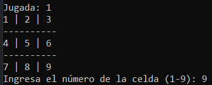
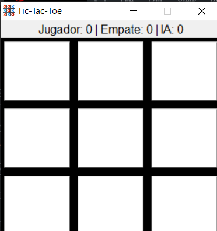

# Tic-Tac-Toe-Python

Este proyecto presenta dos versiones del famoso juego Tic-Tac-Toe en Python, cada una con características distintas:

## Versión 1: Tic-Tac-Toe.py

Esta versión incorpora inteligencia artificial mediante el algoritmo minimax. 

### Características
- Jugabilidad contra una IA.
- Implementación del algoritmo minimax para la toma de decisiones de la IA.
### Captura de ejecución 

## Versión 2: Tic-Tac-Toe con Interfaz Gráfica

Esta versión utiliza el mismo código que la primera, pero se ha añadido una interfaz gráfica y se ha optimizado con el algoritmo de poda alfa-beta para mejorar la eficiencia del juego.

### Características
- Interfaz gráfica para una experiencia más visual.
- Implementación del algoritmo de poda alfa-beta para optimizar las decisiones.
- Seguimiento de estadísticas de victorias, derrotas y empates.
### Captura de ejecución 

## Ejecución

Para la primera versión, se requiere tener Python instalado. De manera similar, para la segunda versión también se necesita tener Python instalado; sin embargo, se creó un archivo .exe para facilitar la ejecución de la misma.
